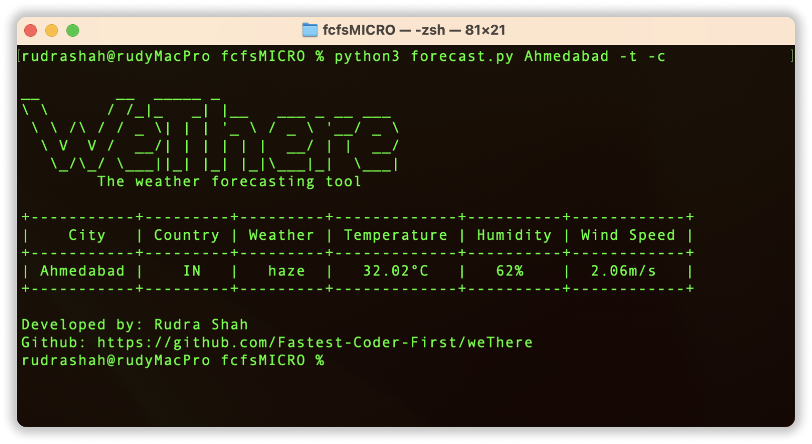

# WeThere: The Weather Forecasting Tool
WeThere is a command-line tool that retrieves the current weather forecast for a specified city. It leverages the OpenWeatherMap API to fetch weather data and parses it using Python. This solution demonstrates how GitHub Copilot can assist with API usage, data parsing, and error handling.  

###### Figure 1: WeThere in action

## Prerequisites
Before using the WeThere tool, make sure you have the following:

* Python installed on your system.

* An API key from OpenWeatherMap. You can obtain a free API key by signing up on their website.

## Installation
1. Clone the repository to your local machine.
2. Navigate to the project directory.
3. Install the required dependencies using the following command:  
`
pip install -r requirements.txt
`
4. Create a file named `.env` in the project directory and add the following line to it:  
`
API_KEY=<your-api-key>
`
5. Run the tool using the following command:  
`
python forecast.py <city-name>
`

## Usage
The tool accepts a Three argument, the name of the city for which you want to fetch the weather forecast and two optional arguments, the unit of temperature and the format of the output. Below is the list of all the arguments that can be used with the tool:

* Flags:  
`-h, --help` - Show the help message and exit.  
`-t` - Display data in tabular format.  
`-c` - Display Temperature in Celsius.  
`-f` - Display Temperature in Fahrenheit.  
`-k` - Display Temperature in Kelvin.  

*Note: `-c`, `-f` and `-k` can't be used together.*

## Code Explanation
The WeThere tool consists of the following components:

* The asciart function: Prints an ASCII art representation of WeThere.
* Loading environment variables: Uses the dotenv library to load the OpenWeatherMap API key from the .env file.
* The getWeather function: Retrieves the weather details for a specified city using the OpenWeatherMap API. It also handles potential errors and prints the corresponding error messages.
* The footer function: Prints the developer information and GitHub repository link.
* The main function: Calls the asciart function, the getWeather function, and the footer function based on user input.
* Execution flow: When the script is executed, the main function is called, processing the command-line arguments to obtain the city name and optional table format flag.

## Error Handling
The WeThere tool incorporates error handling to ensure a smooth user experience. It handles the following scenarios:

* Invalid city name: The tool checks if the provided city name contains only alphabetic characters. If not, it displays an error message.
* Missing command-line argument: If no city name is provided as a command-line argument, it displays an error message and exits.
* API response errors: The tool handles various HTTP status codes returned by the OpenWeatherMap API and prints corresponding error messages to provide meaningful feedback.

WeThere is a powerful command-line weather forecasting tool that demonstrates the usage of the OpenWeatherMap API, data parsing in Python, and effective error handling. Feel free to customize and enhance the tool according to your requirements. Enjoy forecasting the weather with WeThere!